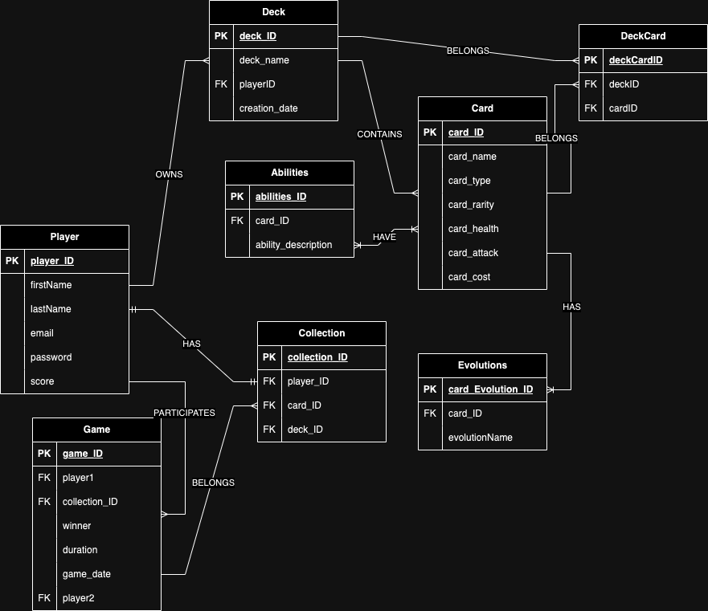

# Database Modeling Exercise - Chronicle Doom

## Entity Relationship Diagram Model

## JUSTIFICATION OF FOREIGN KEYS AND PRIMARY KEYS

#### The primary keys are used to uniquely identify each record in the table. The foreign keys are used to create a relationship between the tables, allowing for data to be shared between them. Foreign keys point to the primary key of another table allowing referential integrity to be maintained.

 In brief, I have decided to create this database schema in this specific manner to ensure that it correctly reflects the logic of the Pokémon TCG game and ensures data integrity, while providing a solid framework for efficient queries and data manipulation operations.

## Normalization
The database schema is normalized to Third Normal Form (3NF):

### - First Normal Form (1NF)

All columns contain atomic values.
Each table has a primary key.

### - Second Normal Form (2NF)

All non-key attributes are fully functionally dependent on the primary key.

### - Third Normal Form (3NF)

All attributes are functionally dependent only on the primary key (no transitive dependencies).
